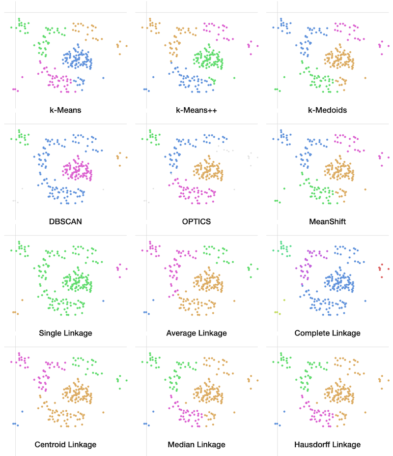

# Clustering Algorithms

Pure TypeScript implementations of common clustering algorithms.

``` cli
npm install t-ski/clustering-algorithms
```

1. [Interface](#interface)
2. [Algorithms](#algorithms)
3. [Utilities](#utilities)



## Interface

``` ts
// e.g.
import * as clA from "t-ski/clustering-algorithms"
```

``` ts
type TVector = number[]
type TMatrix[] = number[][]
type TCluster = TVector[]

interface AClustering<O = TCluster> {
    clusters: O[]
}
```

## Algorithms

``` ts
clA.<algorithm>(data: I[], ...args): AClustering<I>
```

### Centroid-based

``` ts
clA.<algorithm>(data: number[]|TVector[], k: number = 2): AClustering
```

``` ts
new clA.KMeans(DATA, 3).clusters;
```

#### k-Means

`O(n²) | Θ(n)`

``` ts
clA.KMeans(data, k?)
```

#### k-Means++

`O(n²) | Θ(n)`

``` ts
clA.KMeansPP(data, k?)
```

#### k-Medoids

`O(n²) | Θ(n)`

``` ts
clA.KMedoids(data, k?)
```

---

### Density-based

``` ts
clA.<algorithm>(data: number[]|TVector[], epsilon?: number): AClustering
```

> Epsilon is estimated from the given data if not defined.

``` ts
new clA.MeanShift(DATA, 2).clusters;
```

#### MeanShift

`O = Θ(n²)`

``` ts
clA.OPTICS(data, epsilon?, minPoints: number = 5): AClustering & { noise: TCluster }
```

#### DBSCAN

`O(n²) | Θ(n log n)`

``` ts
clA.DBSCAN(data, epsilon?, minPoints: number = 5): AClustering & { noise: TCluster }
```

#### OPTICS

`O(n²) | Θ(n log n)`

``` ts
clA.OPTICS(data, epsilon?, minPoints: number = 5): AClustering & { noise: TCluster }
```

---

### Graph-based

``` ts
clA.<algorithm>(adjacencyMatrix: TMatrix, k: number = 2): AClustering<number[]>
```

> Input to graph-based clustering is a target graph's adjacency matrix. Output corresponds to clusters of related graph node indexes.

``` ts
new clA.Divisive(DATA, 2).clusters;
```

#### Divisive Clustering

`O = Θ(n²)`

``` ts
clA.Divisive(adjacencyMatrix, k: number = 2)
```

#### Markov Clustering (MCL)

`O = Θ(n³)`

``` ts
clA.Markov(adjacencyMatrix, e: number = 2, r: number = 2)
```

---

### Hierarchy-based

``` ts
clA.<algorithm>(data: number[]|TVector[], k: number = 2): AClustering
```

``` ts
new clA.AverageLinkage(DATA, 4).clusters;
```

#### Average Linkage

`O = Θ(n³)`

``` ts
clA.AverageLinkage(data, k?)
```

#### Centroid Linkage

`O = Θ(n³)`

``` ts
clA.CentroidLinkage(data, k?)
```

#### Complete Linkage

`O = Θ(n³)`

``` ts
clA.CompleteLinkage(data, k?)
```

#### Hausdorff Linkage

`O = Θ(n³)`

``` ts
clA.HausdorffLinkage(data, k?)
```

#### Median Linkage

`O = Θ(n³)`

``` ts
clA.MedianLinkage(data, k?)
```

#### Single Linkage

`O = Θ(n³)`

``` ts
clA.SingleLinkage(data, k?)
```

## Utilities

### Distance Metrics

`f: (ℝ×…×ℝ)² ↦ ℕ`

``` ts
clA.util.Distance.<metric>(p1: TVector, p2: TVector = []): number
```

``` ts
clA.AClustering.setDistanceMetric(util.Distance.manhattan);

const clusters = new clA.KMeans(DATA, 3).clusters;
```

#### Euclidean (2-Norm) `default`

``` ts
clA.util.Distance.euclidean(p1: TVector, p2: TVector = []): number
```

#### Manhattan 

``` ts
clA.util.Distance.manhattan(p1: TVector, p2: TVector = []): number
```

#### Chebyshev 

``` ts
clA.util.Distance.chebyshev(p1: TVector, p2: TVector = []): number
```

#### Cosine (normal)

``` ts
clA.util.Distance.cosine(p1: TVector, p2: TVector = []): number
```

---

### Quality Metrics

``` ts
clA.util.Quality.<metric>(clusters: TCluster[]): number
```

``` ts
const clusters = new clA.KMeans(DATA, 3).clusters;

const clusteringQuality = clA.util.Quality.silhouetteCoefficient(clusters);
```

#### Silhouette Coefficient

`f: ℕ×(ℝ×…×ℝ) ↦ [-1,+1]`

``` ts
clA.util.Quality.silhouetteCoefficient(clusters: TCluster[]): number
```

#### Dunn Index

`f: ℕ×(ℝ×…×ℝ) ↦ [0,+∞) → +∞`

``` ts
clA.util.Quality.dunnIndey(clusters: TCluster[]): number
```
// Dunn → [0,+∞) ↑

#### Davies-Bouldin Index

`f: ℕ×(ℝ×…×ℝ) ↦ [0,+∞) → 0`

``` ts
clA.util.Quality.daviesBouldinIndex(clusters: TCluster[]): number
```

---

### Vector Data Map

The `VectorDataMap` utility class helps with associating arbitrary entites with data points:

``` ts
type TDataPoint<T> = [ TVector, T ]

new clA.util.VectorDataMap<T>(data: TDataPoint<T>[]): {
    vectors: TVector[];

    getEntity: (vector: TVector) => T|T[];
    getVector: (entity: T) => TVector;
    getCluster: (clusters: TCluster[], vector: TVector) => number|number[];
    getCluster: (clusters: TCluster[], entity: T) => number|number[];
}
```

``` ts
const dataMap = new util.VectorDataMap(DATA);

const clustering = new DBSCAN(dataMap.vectors, 50, 4);
const focusVector = [ 646.04912, 258.00177 ];

console.log(`ID: ${
    dataMap.getEntity(focusVector)?.id
}`);
console.log(`in cluster: ${
    dataMap.getCluster(clustering.clusters, focusVector)
}`);
```

##

<sub>&copy; Thassilo Martin Schiepanski</sub>